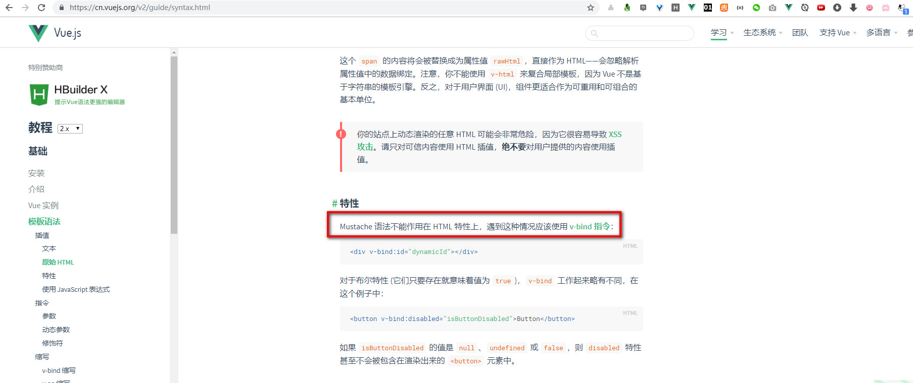

<!--  -->

<!-- Visual Studio Code编写并实时预览Markdown
https://blog.csdn.net/supergao222/article/details/78596704

两种方法：
Ctrl + Shift + P 调出主命令框，输入 Markdown,选择Markdown: Open Preview to the Side，就能调出实时预览框;
先按Ctrl + K，然后放掉，紧接着再按 v，也能调出实时预览框

抽空整理下markdown语法

微信自定义菜单编辑工具  https://wei.jiept.com/
在线代码格式化  http://tool.oschina.net/codeformat/json

 -->
<!-- E:\z_dreamer\planner\2019\代码汇总\nonsense\year\2019\20190515_1405.md -->
<!-- E:\z_dreamer\planner\2019\代码汇总\nonsense\images\2019\201905\20190515\2019-05-15_135431.jpg -->

<!--  -->

写过的烂代码：hmtl里面添加  `{{  }}`

**Mustache 语法不能作用在 HTML 特性上，遇到这种情况应该使用 v-bind 指令：**

https://cn.vuejs.org/v2/guide/syntax.html#%E7%89%B9%E6%80%A7