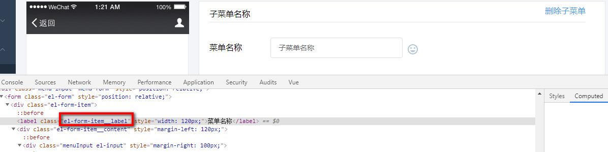

## 修改elementui默认样式

需要更改的组件里新增一个style标签 ，**（注意：不要加scoped ，否则无法覆盖ele-ui的原有样式）**，然后通过审查元素获取class，再重新设置样式

最好在获取到的样式里加上能限制范围的父层选择器，不然就变成全局样式




```
.el-form-item__label

<style lang="scss">
@import '../../styles/custom-menu.scss';
  .menu-form .el-form-item__label {
      text-align: left!important;
      font-size: 20px!important;
      color: #000!important;
      font-weight: normal!important;
}
</style>
```
